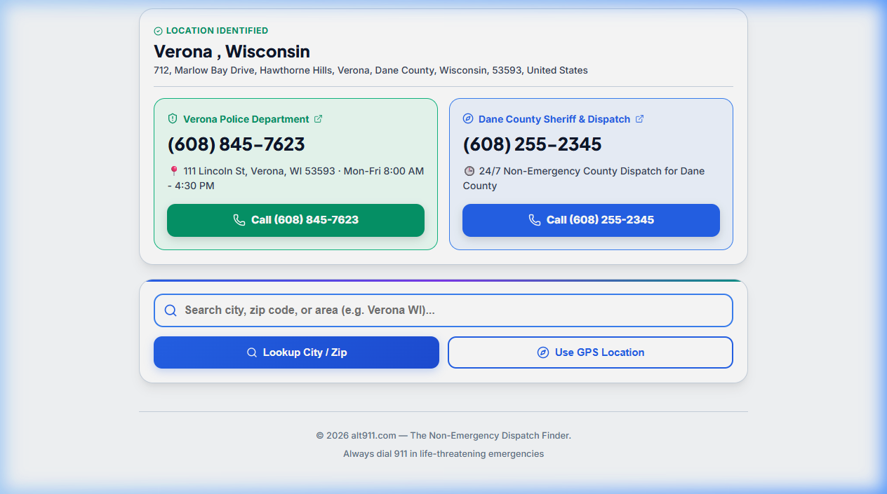
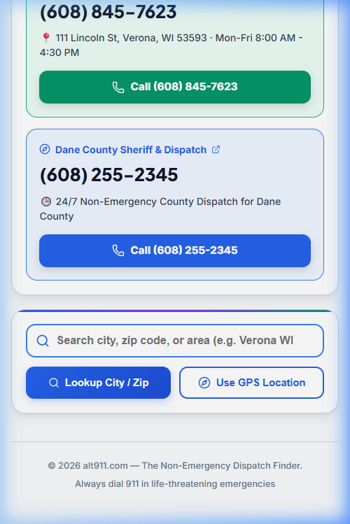

# alt911.com — The Non-Emergency Dispatch Finder

> **Instant 10-Digit Police Dispatch & Municipal 311 Lookup Service**

**alt911.com** is a web application designed to help individuals instantly locate local 10-digit non-emergency police dispatch lines, county sheriff numbers, and 311 municipal service channels based on their live GPS location or typed search queries (city, zip code, or address).

The goal of this service is to prevent misdialing 911 for non-life-threatening situations (such as noise complaints, historical property damage, parking issues, or lost items), keeping 911 operators clear for critical life-safety emergencies.

---

## 📸 Screenshots

| Desktop View | Mobile View |
| :---: | :---: |
|  |  |

---

## 🚀 Key Features

* **📍 Live Location Detection**: One-tap GPS detection resolves your exact city, county, and state via reverse geocoding.
* **⚡ Instant 0ms Local Directory**: Built-in client-side database instantly matches municipal police departments and 24/7 county dispatch lines.
* **🔍 Pure Client-Side Fetching**: 100% direct browser execution without server-side processing, API rate limits, or Vercel serverless costs.
* **🏢 Dual City & County Line Display**: Shows both municipal police lines and regional/county 24/7 dispatch lines when both exist.
* **📍 Station Address & Hours Extraction**: Automatically displays verified police station street addresses and operating hours/24-7 availability.
* **📱 Clear Search UI**: Full-width search input with automatic text highlighting on focus, one-tap `(X)` clear button, and distinct high-contrast border.
* **🏢 Conditional 311 Municipal Card**: Automatically renders a direct 311 municipal call button when searching within one of 36+ participating North American cities.
* **🌓 Smart Dark / Light Mode**: Automatically adapts theme based on device OS preference and time-of-day (Light theme 7am–7pm / Dark theme 7pm–7am) with a manual header toggle.
* **🌐 Universal N11 Directory**: Includes a guide for 211, 311, 511, 811, 988, UK 101/111, New Zealand 105, Australia 131 444, and Germany 116 117.

---

## 🛠️ How the Lookup Pipeline Works

```
[ User Input / GPS Coords ]
            │
            ▼
[ OpenStreetMap / Nominatim Reverse Geocoding ] ──► (Resolves City, County, State)
            │
            ▼
[ 100% Client-Side Search Pipeline ]
            │
            ├─► 1. Instant Match against Built-in Client Directory (0ms)
            ├─► 2. Direct Browser Query to DuckDuckGo Instant Answer API
            └─► 3. Instant 1-Tap Call & Direct Phone Search Buttons
            │
            ▼
[ Render Verified Dispatch Cards & 1-Click Call Buttons ]
```

1. **Geocoding**: When GPS is triggered or a search term is submitted, the browser queries the **OpenStreetMap Nominatim API** to resolve geographic coordinates to structured location metadata (City, County, State).
2. **Instant Directory Match**: The client checks an embedded client-side database of verified 10-digit police department lines and 24/7 county dispatch centers.
3. **CORS API Query**: If unlisted, the client fetches CORS-enabled search endpoints directly from the user's phone or browser.
4. **1-Tap Action Cards**: Displays verified 10-digit phone numbers, station addresses, 24/7 dispatch lines, and direct 1-tap call buttons right on the main page.

---

## 📦 Tech Stack & Dependencies

* **Frontend Framework**: [React 19](https://react.dev/) & [TypeScript](https://www.typescriptlang.org/)
* **Build Tool**: [Vite 8](https://vitejs.dev/)
* **Iconography**: [Lucide React](https://lucide.dev/)
* **Geocoding API**: [OpenStreetMap Nominatim](https://nominatim.openstreetmap.org/)
* **Styling**: Vanilla CSS with modern custom design tokens and dynamic Light/Dark mode state

---

## 🛠️ Installation & Local Development

### Prerequisites
* **Node.js**: `v18.0.0` or higher
* **npm**: `v9.0.0` or higher

### Steps

1. **Clone the repository**:
   ```bash
   git clone https://github.com/chrispauly/alt911.com.git
   cd alt911.com
   ```

2. **Install dependencies**:
   ```bash
   npm install
   ```

3. **Start the local development server**:
   ```bash
   npm run dev
   ```
   Open `http://localhost:5173` in your web browser.

4. **Build for production**:
   ```bash
   npm run build
   ```

---

## 📄 Security & Privacy

* **No User Tracking**: User location coordinates and search terms are processed ephemeral-only for reverse geocoding and phone matching. No user location data is stored or logged.
* **Client-Only Execution**: Zero server-side data processing or logging. All requests originate directly from the user's browser.

---

## ⚖️ License

Distributed under the MIT License. See `LICENSE` for details.
